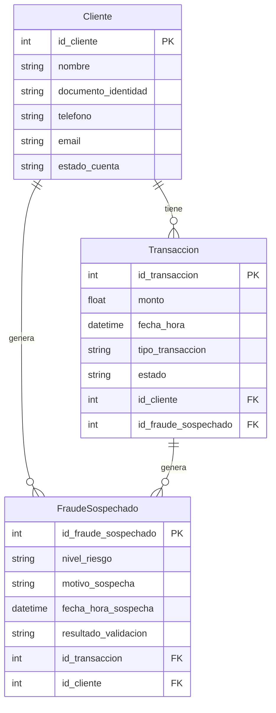

Especificación de Requerimientos - Sistema Antifraude Transaccional
1. Introducción
Este documento describe los requerimientos funcionales y técnicos para el desarrollo de un sistema antifraude transaccional en el sector financiero. El sistema se implementará utilizando AWS para la infraestructura en la nube y se enfocará en la detección de fraudes, bloqueo automático de cuentas y validación mediante IA. 
2. Descripción General
El sistema antifraude transaccional tiene como objetivo detectar transacciones sospechosas en tiempo real, bloquear cuentas asociadas a dichas transacciones y realizar una validación automática mediante una llamada orquestada por una IA. El sistema estará implementado en AWS, utilizando servicios como Lambda, RDS, y otros relacionados a la arquitectura de nube segura.
3. Modelo de Datos
3.1 Entidades Principales
Entidad: Transacción
Descripción: Representa la transacción financiera que está siendo monitoreada por el sistema de antifraude.
Campos esenciales:
  - id_transaccion (PK): Identificador único de la transacción.
  - monto: Monto de la transacción.
  - fecha_hora: Fecha y hora en que se realizó la transacción.
  - tipo_transaccion: Tipo de transacción (compra, transferencia, retiro).
  - estado: Estado de la transacción (pendiente, bloqueada, aprobada, rechazada).
  - id_cliente: Relación con el cliente que realizó la transacción.
  - id_fraude_sospechado: Relación con la entidad de análisis de fraude.
Entidad: Cliente
Descripción: Representa al cliente de la entidad financiera cuyas transacciones están siendo evaluadas.
Campos esenciales:
  - id_cliente (PK): Identificador único del cliente.
  - nombre: Nombre completo del cliente.
  - documento_identidad: Número de identificación del cliente.
  - telefono: Número de teléfono para validaciones.
  - email: Correo electrónico del cliente.
  - estado_cuenta: Estado de la cuenta (activa, bloqueada, inactiva).
Entidad: FraudeSospechado
Descripción: Representa una alerta o detección de fraude asociada a una transacción o cuenta del cliente.
Campos esenciales:
  - id_fraude_sospechado (PK): Identificador único del posible fraude.
  - nivel_riesgo: Nivel de riesgo asignado (bajo, medio, alto).
  - motivo_sospecha: Motivo por el cual la transacción fue marcada como sospechosa.
  - fecha_hora_sospecha: Fecha y hora de la alerta de fraude.
  - resultado_validacion: Resultado del proceso de validación mediante IA (validado, rechazado, pendiente).
  - id_transaccion: Relación con la transacción sospechosa.
3.2 Relaciones entre Entidades
Las entidades tienen las siguientes relaciones:
  - Cliente ↔ Transacción: Un cliente puede realizar muchas transacciones (relación 1:N).
  - Transacción ↔ FraudeSospechado: Una transacción puede generar una o más alertas de fraude (1:N).
  - Cliente ↔ FraudeSospechado: Un cliente puede tener múltiples alertas de fraude relacionadas con sus transacciones.
4. Casos de Uso del MVP
Los casos de uso más importantes para el MVP son los siguientes:
4.1 Bloqueo de Cuenta por Sospecha de Fraude
Cuando se detecta una transacción sospechosa, el sistema debe bloquear de forma automática la cuenta del cliente o la transacción.
4.2 Orquestación de Llamada mediante IA
El sistema orquesta una llamada al cliente mediante IA para verificar la transacción y la identidad del usuario.
4.3 Validación de Identidad del Cliente
Durante la llamada, la IA verifica la identidad del cliente solicitando información personal y detalles de la transacción.
4.4 Desbloqueo Automático de la Cuenta
Si la IA valida que la transacción es legítima, el sistema procede a desbloquear la cuenta automáticamente.
4.5 Mantener el Bloqueo por Fallo en la Verificación
Si la validación falla, el sistema mantiene el bloqueo de la cuenta hasta que se resuelva el caso.
4.6 Notificación al Cliente
El cliente debe ser notificado del resultado del proceso de validación, ya sea que la cuenta se desbloqueó o permanece bloqueada.
5. Requerimientos Técnicos
El sistema se implementará en AWS y utilizará los siguientes servicios clave:
5.1 AWS Lambda
Para la ejecución de lógica de negocio, incluyendo la detección de fraudes en tiempo real y la orquestación de llamadas.
5.2 AWS RDS
Para el almacenamiento de datos transaccionales, clientes y alertas de fraude en una base de datos relacional segura.
5.3 AWS SNS (Simple Notification Service)
Para la notificación y envío de mensajes a los clientes sobre el estado de sus cuentas.
5.4 AWS Connect
Para la implementación del servicio de llamadas automatizadas mediante IA que valida la identidad del cliente.
6. Diagrama de Modelo de Datos (Mermaid)

